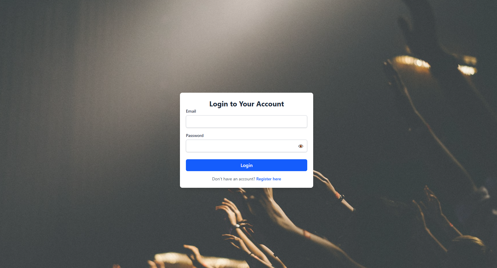
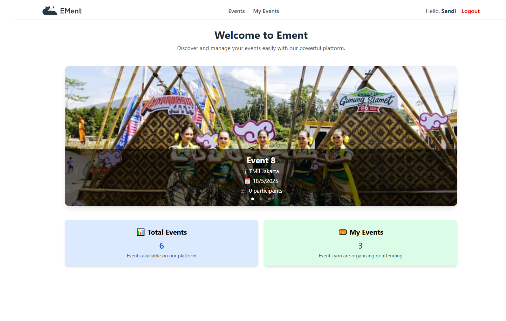

## Ement

**Ement** is a web-based event management application that allows users to create, view, and register for events. This app is designed for public use.

**Ement** adalah aplikasi manajemen event berbasis web yang memungkinkan pengguna untuk membuat, melihat, dan mendaftar ke berbagai event. Aplikasi ini dirancang untuk digunakan oleh publik secara umum.

---

### 🚀 Key Features | Fitur Utama

- 🔐 **User Authentication** – Register and log in to your account.
- 🗕️ **Create & Manage Events** – Create new events and manage your existing ones.
- 📝 **Event Registration** – Sign up for available events.
- 📄 **Public Event Pages** – View detailed information and organizer info.
- ⚙️ **Personal Dashboard** – View and manage events you joined or created.

---

### 🛠️ Built With | Teknologi yang Digunakan

- [React](https://reactjs.org/)
- [Vite](https://vitejs.dev/)
- [JavaScript (ES6+)](https://developer.mozilla.org/en-US/docs/Web/JavaScript)
- [Tailwind CSS](https://tailwindcss.com/)
- [Node.js & npm](https://nodejs.org/)

---

### 📈 Demo

[Ement App](https://ement.netlify.app/)

---

### 🗼 Screenshot

Here is the user interface of the **Ement** application:




---

### ▶️ Run Locally

Clone the project:

```bash
git clone https://github.com/tiedsandi/project_event-management-frontend
```

Go to the project directory:

```bash
cd project_event-management-frontend
```

Install dependencies:

```bash
npm install
```

Start the server:

```bash
npm run dev
```

<!--
#### Environment Variables

To run this project, you will need to add the following environment variable to your `.env.local` file:

```
MOVIEDB_API_KEY=your_api_key_here
``` -->

---

### 📁 Project Structure | Struktur Proyek

```
ement/
├── public/             # Public assets (images, logos)
├── src/
│   ├── components/     # UI components like forms, header, layout
│   ├── pages/          # Pages such as Home, Login, Register, Events, etc.
│   ├── utils/          # Utility functions like auth.js
│   └── App.jsx         # Root component
├── package.json
└── README.md
```

---

### 📌 Additional Notes | Catatan Tambahan

- Make sure you have the latest version of **Node.js** installed.
<!-- - This is a frontend-only application. You need to connect it to a backend API (not included). You can go to:
  [Backend Repository](https://github.com/tiedsandi/project_event-management-backend) -->
- Responsive and user-friendly layout.

---

## 👋 Hi, I'm Fachran!

### 🚀 About Me

I'm a junior web developer based in Jakarta, Indonesia, with professional experience at Sinarmas Land and a portfolio of personal projects. I specialize in both front-end and back-end development using JavaScript, PHP, and various modern frameworks and tools. I enjoy learning new technologies, quickly grasp concepts, and can work effectively both independently and as part of a team. With a passion for continuous growth, I’m ready to contribute to dynamic development teams and tackle new challenges.

### 🛠️ Skills

**Programming Languages:** JavaScript, PHP
**Frameworks & Libraries:** React.js, Laravel, Node.js, Express.js, Redux, Next.js
**Database & API:** MySQL, PostgreSQL, MongoDB, RESTful API (development & integration using Laravel & Express)
**Tools:** Git, VS Code
**Soft Skills:** Problem-solving, teamwork, fast learner
**Certifications:** Junior Web Programmer (BNSP, 2025), BinarAcademy Graduate (2022)

### 🧠 Highlights

- Developed low-code applications using OutSystems during a contract at Sinarmas Land, focusing on responsive web and mobile interfaces.
- Explore some of my featured projects by visiting my [GitHub profile](https://github.com/fachransandi) and checking the pinned repositories.
- You can also view my portfolio and professional experience on my [LinkedIn](https://www.linkedin.com/in/fachransandi/) or personal [website](https://fachran-sandi.netlify.app/).
- Strong academic foundation with a 3.80 GPA and experience as a teaching assistant in database fundamentals.

### 🔗 Links

[](https://fachran-sandi.netlify.app/)
[](https://www.linkedin.com/in/fachransandi/)
